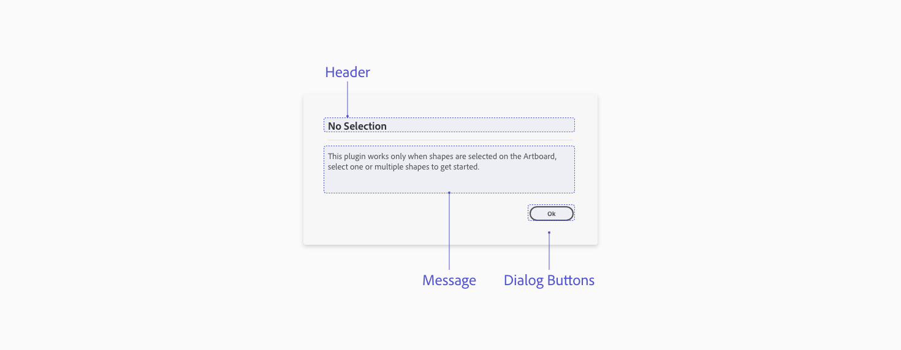
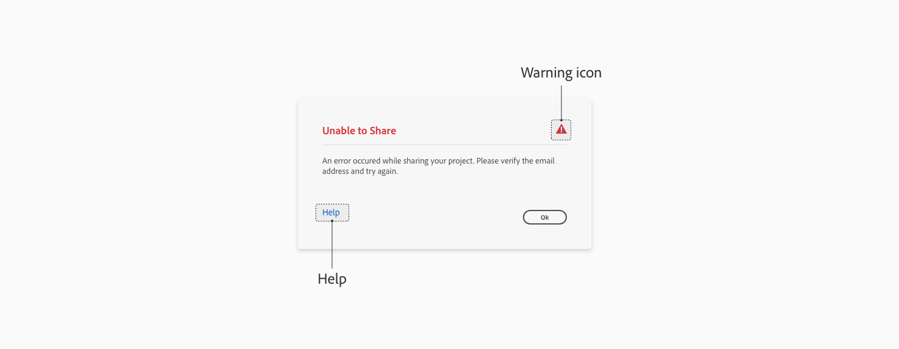
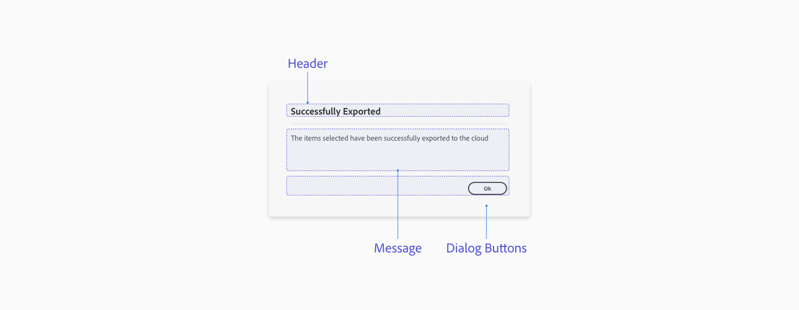
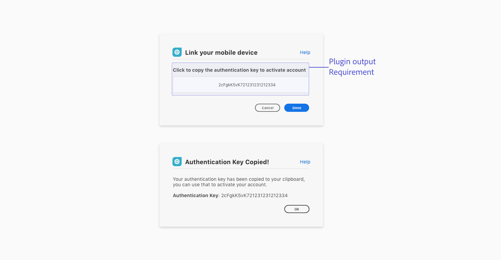
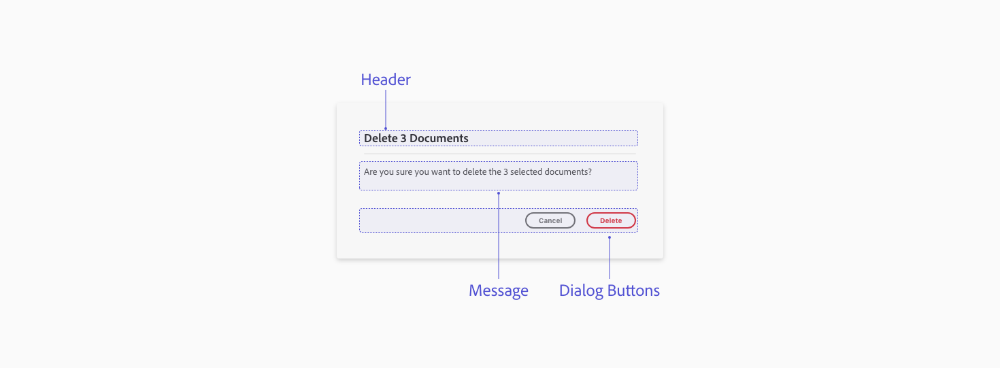

# **Provide feedback**

These are the guidelines and best practices on when and how to provide users with feedback as they interact with your plugin.

----------
# **Alert Dialogs & Messaging**

Alerts are handled through modal dialogs. Here are some best practices and examples for plugin alert messaging. These guidelines cover when and how to clearly communicate alerts to the user, what links to include, and more. 

## **Alert Dialogs**

Use alert messaging whenever the plugin cannot perform the intended task, dialogs are persistent until dismissed

### **UI Pattern**

**Content**

> **Header** 
> Have a clear header that describes the error

> **Message**
> Explain what error was encountered and give a clear actionable solution. Also avoid blaming the user or XD. 

> **Dialog Buttons**
> Include at least one modal dismissal button to allow the user to dismiss/close the modal

### **UI Recommendations**

**Content**

> **Warning icon**
> To help communicate critical information for an error you can include a warning icon next to the header

> **Help**
> If a plugin has a help page, consider adding it on the **error modal dialog.**

> **Visual/tutorials**
> Provide image/GIF example as part of the dialog, to help users understand the actionable solution 

> **Messaging**
> In the alert messages use language that is easy to understand for the user. 

**Examples**

> **Update plugin selection** 
> “This plugin works only when shapes are selected on the Artboard, select one or multiple shapes to get started”.

> **Unable to share**
> “An error occurred while sharing your project. Please verify the email. address and try again”.

> **Network connectivity** 
> “Please connect to WiFi to sync your tasks to your product management tool”.

## Alert Dialog Examples

 **Incompatible selection**

**Information dialog** - when a plugin can’t complete an action based on the object selected, render an information dialog. 

**Operation failed to complete**

**Error dialog** - when a plugin can’t complete an operation, render an error dialog to let user know the operation failed and why it failed.

**Network connectivity issue**

**Information dialog** - if plugin is unable to connect to the internet to complete an action, then use a information modal dialog to communicate that to the user.

----------
## Success Messaging

**Use case**
Use success messaging whenever the plugin successfully completes a task and has **no visual output** on the canvas.

**UI Pattern**

**Content**
**Header** 
Have a clear header for the dialog. 

**Message**
Explain what the plugin successfully completed, if it is not visually apparent to the user.

**Dialog Buttons**
Include at least one modal dismissal button to allow the user to dismiss/close the modal.

## Plugin Output

If a plugin generates output that the user needs to complete a workflow, then the plugin needs to provides that information to the user.

**Plugin output in the UI**

- In use cases like these the plugin output can be shown in the UI, copied onto the clipboard, populated on the document or generate a file. 

- Avoid having the user go into the developer console to complete their workflow.

**Requirement**

- Plugin output is shown in the UI and prompts the user on the next step.

**Example:** Copied onto the clipboard 
The plugin can add copy to the clipboard and provides the user with instructions through the UI.

**Don’t**
Require users to go into the developer console to complete an action. 

----------
## Permission dialogs

**Use case**
Use permission dialogs when being destructive or making modifications.

**UI Pattern**

**Content**
**Header** 
Have a clear header for the dialog. 

**Message**
Explain the destructive action or modification and ask for the users permission

**Dialog Buttons**
Include a modal dismissal button to allow the user to cancel/close the modal and a negative button (red) to highlight that action. 

**Key Commands**
**Esc key or Enter key**
Dismisses the dialog when the “Cancel” button is in focus

----------
## Loaders & Progress bars

let the user know when something is happening in the background in the plugin UI. 

**Determinate**

**Use case**
If the progress can be reflected on a loader. 

**Indeterminate**

**Use case**
If the progress can’t be determined then provide a loader to let the user know something is loading.

