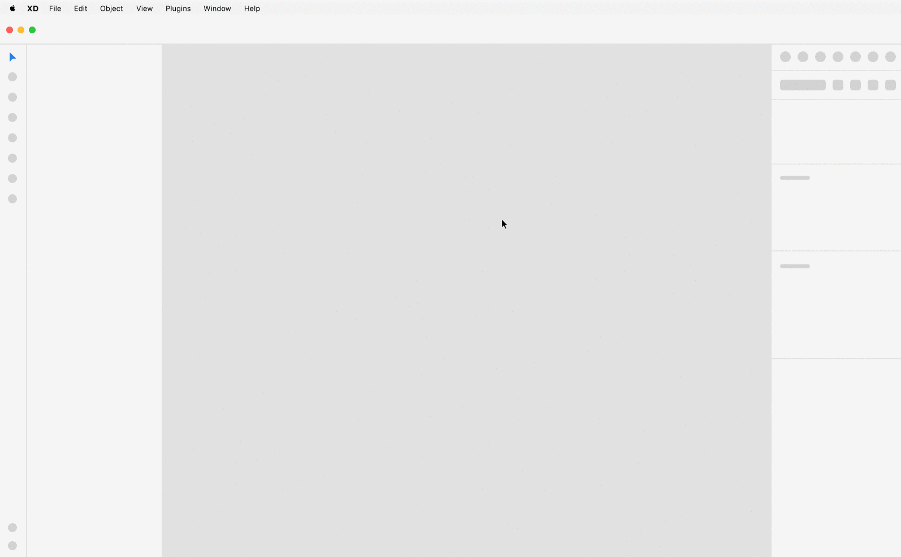
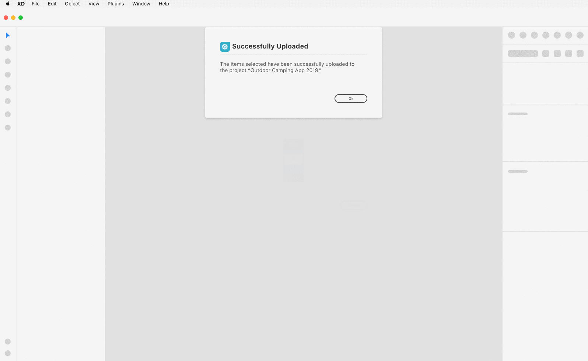

# UX Guidelines

Plugin UX guidelines will include UX requirements and/or UX best practices these will ensure your plugin follows Xd user experience patterns. 

### 1. **[Usability & Behavior](Usability_Behavior.md)**

Guide your users as they interact with your plugin, for example when they first interact with your plugin what can they expect and how can they get the most out of your plugin. 

### 2. **[Interface Guidelines](Interface_Guidelines.md)**

How will user navigate your plugin, what is best entry point and what surface can your plugin can use.

### 3. **[Provide Feedback](Provide_Feedback.md)**

Provide users with feedback as they interact with your plugin, this can be alert & success messaging, permission dialogs or loaders & progress bars to let them know something is running in the background. 

## Plugin workflow

> **Entry Point - where** your user will first interact with your Plugin (i.e. how it’s triggered or opened)

> **Plugin UI** - **how** the user will interact with the plugin once it’s open

> **Execute - when** your plugin runs and executes actions

> **Output** - **what** the user sees after an action is executed

--------
