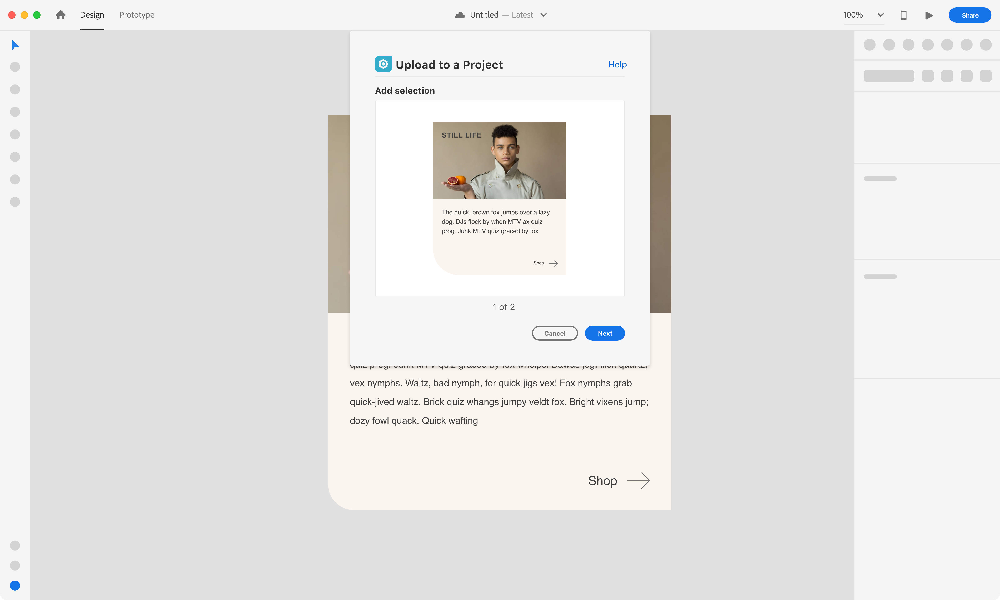
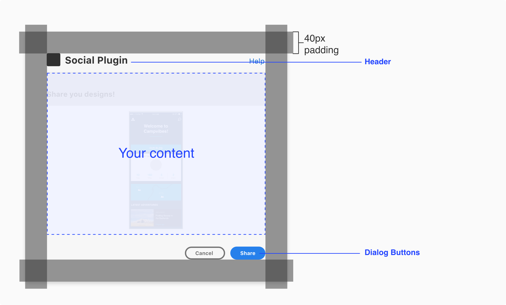
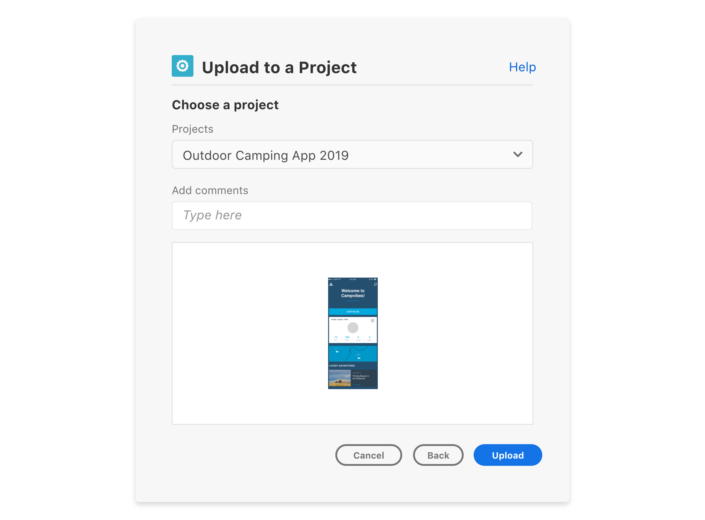
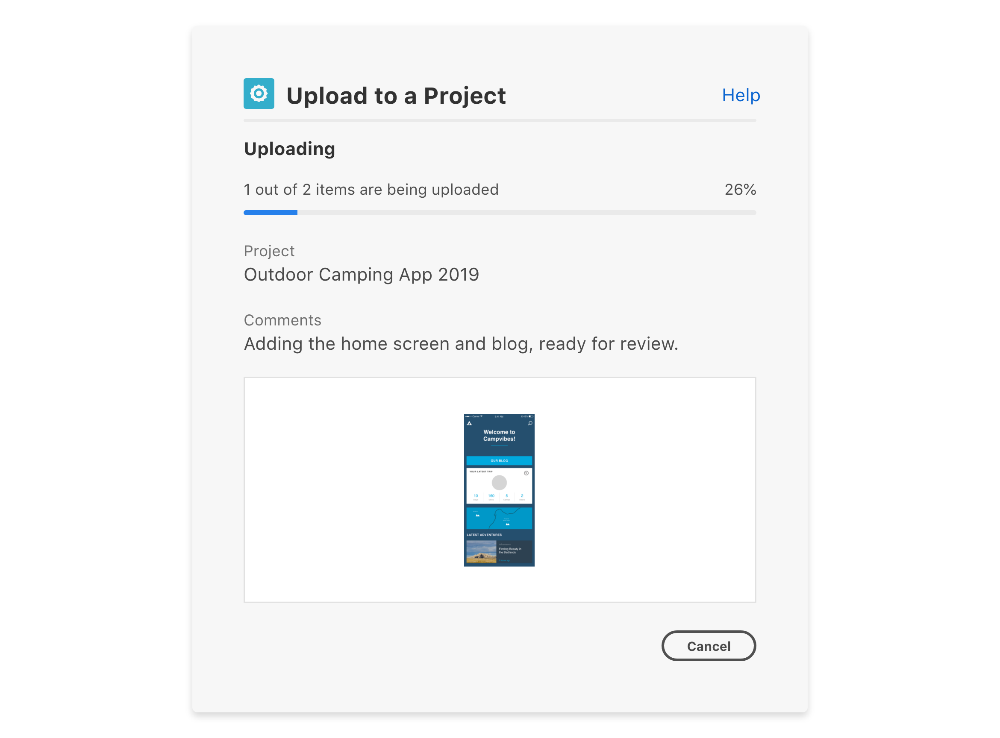
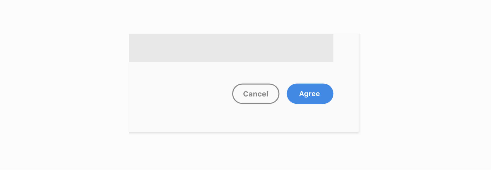
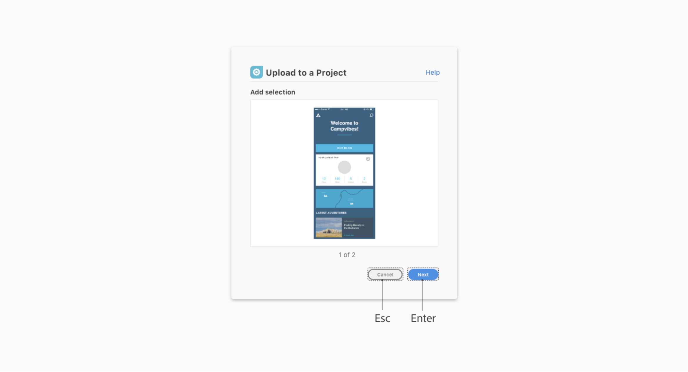

# Modal UX

This section will have recommendations when using a Modal Dialog -  Blocking UI. If the plugin needs to run an action before the user starts a new action then the modal would be recommended for that use case. 

- Overview
- Modal Dialog UI
- Dialog Buttons and Key Commands

----------

  

## Overview

MacOS example

#### Specs

**Padding**  
The modal will have padding built-in (ex: MacOS modal will have a 40px padding). Additional padding shouldn’t be added.

**Configurable content**  
This is what the user can interact with before executing the plugin action. 

#### UX Requirements

**Header**  
Have a clear header for the dialog. e.g. “name of plugin”, “description of workflow”

**Dialog Buttons**  
Include a modal dismissal button to allow the user to cancel/close the modal and a call to action button (blue) to highlight the primary action. 

#### Best Practices

**Plugin Icon**.  
You can include a plugin icon to let the user know they are interacting with your plugin in the modal dialog

  

## Modal Dialog UI

#### Modal dialog plugin UI

#### Step process three buttons

#### Step process loader

  

## Dialog buttons and key commands

#### Buttons

**Use cases**. 
**Call to action**  
The call to action button communicates strong emphasis and is reserved for encouraging critical actions. There should only be one visible call to action button per section.

**Primary**  
The primary button is used for medium emphasis. It should be used in place of a call to action button when the action requires less prominence, or if there are multiple primary actions of the same importance on the page. It can be displayed either in standard style (visible stroke) or in quiet style.

**Secondary**  
The secondary button is for low emphasis. It is meant to be paired with other button types to surface less prominent actions, and should never be the sole button in a group. It can be displayed either in standard style (visible stroke) or in quiet style.

**Negative**  
The negative button is for high emphasis on negative or destructive actions. It should be used sparingly. It can be displayed either in standard style (visible stroke) or in quiet style.

#### Best practice

**Button Group Overflow**  
When horizontal space is limited, button groups stack vertically. 
They should appear in ascending order based on importance, with the most critical action 
at the bottom.

**Use 2 button styles maximum**  
The top-level action within a button group should be a call to action, primary, or negative button. The subsequent buttons should always be secondary buttons of the same style (standard or quiet). Don’t combine more than 2 button styles in a button group.

#### Button labels

Button labels should be clear about the intention of the action. Button text should be 1 to 2 words and consider the number of characters.

#### Key Commands

**Esc key**  
Dismisses the dialog. This is equivalent to choosing “Cancel”.

**Enter key**  
Executes the primary button action.

