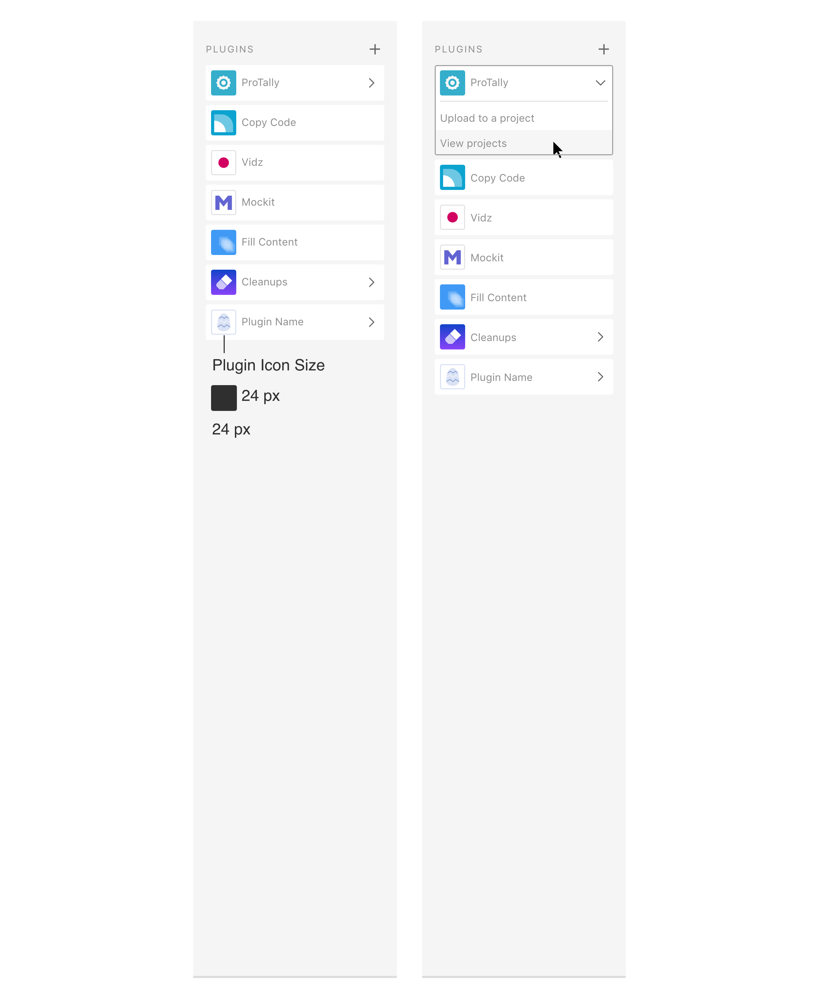
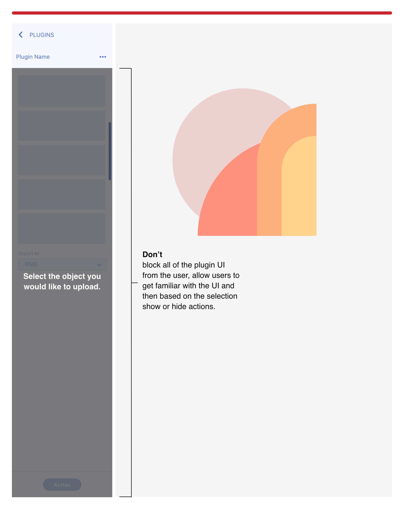
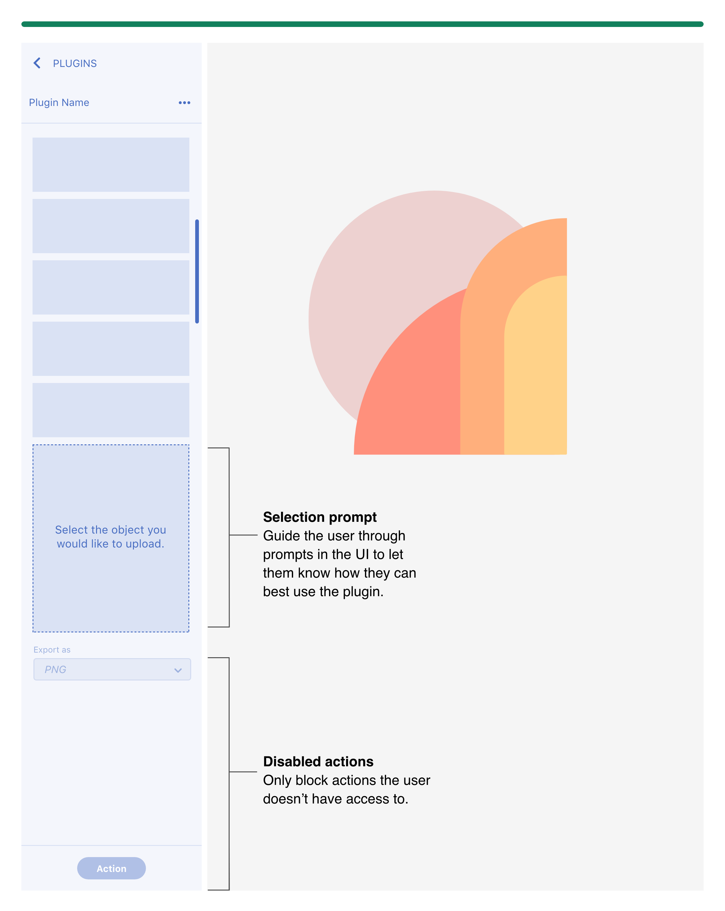
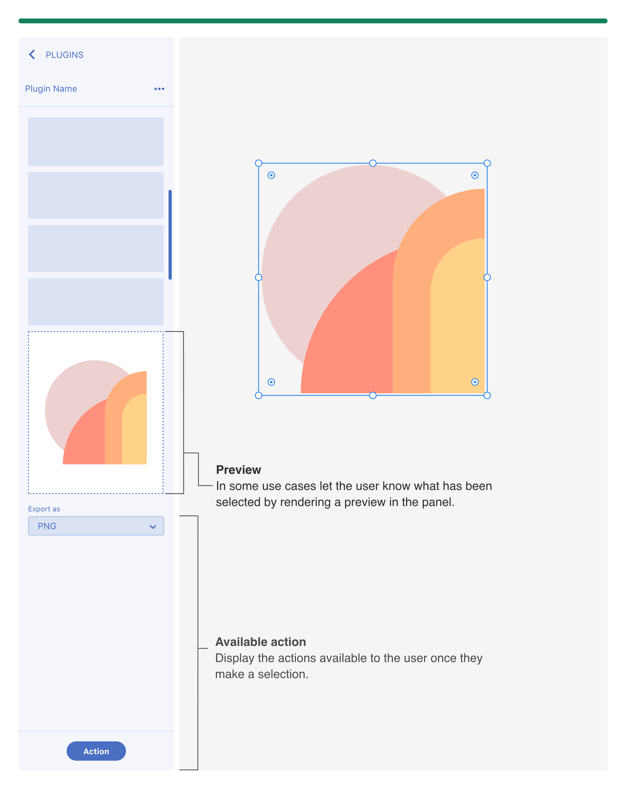
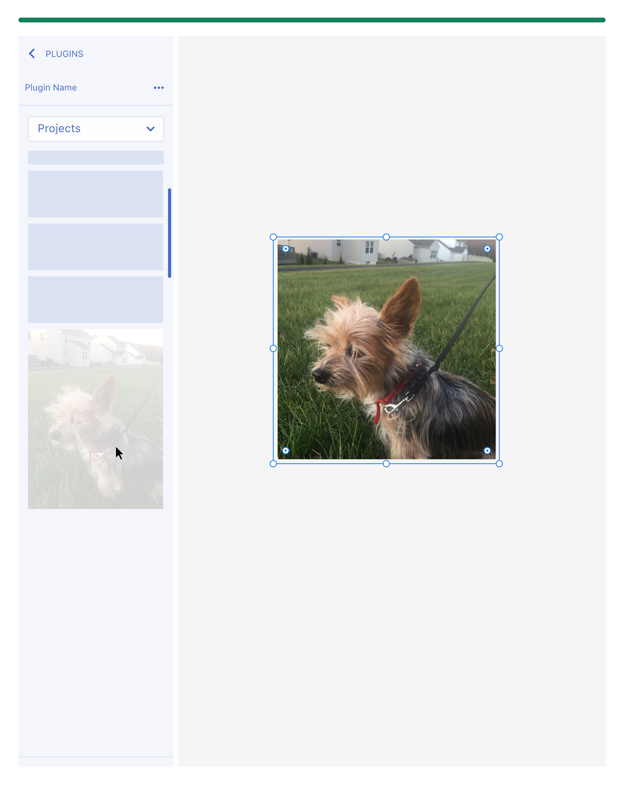
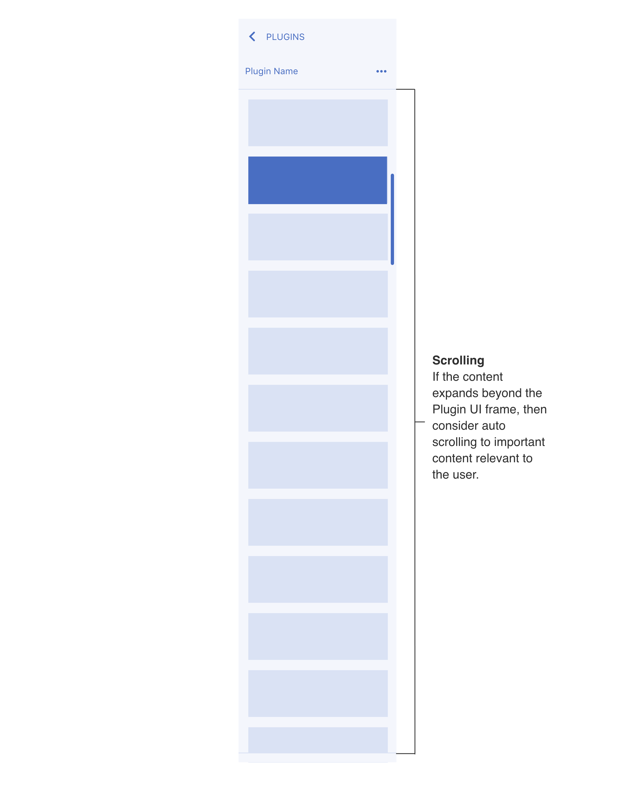
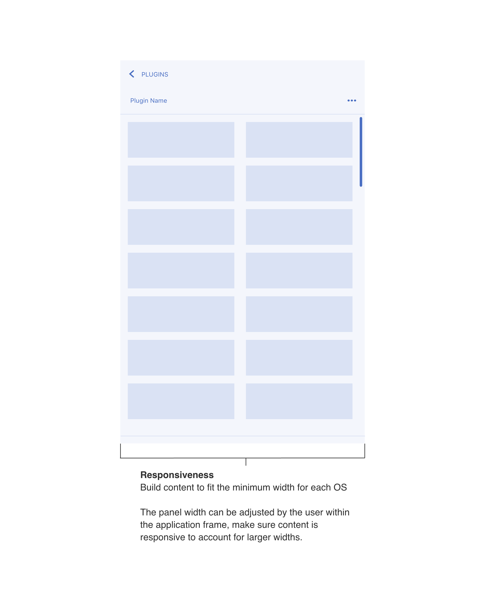
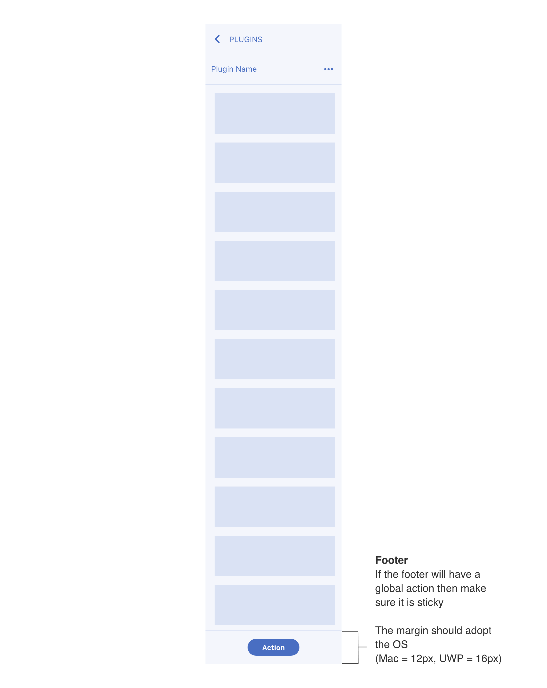

# Panel UX

This section has recommendations when using a Plugins Panel - Non-Blocking UI. If the user needs to have access to the canvas then the plugin panel would be the best option, since it’s contextual to the users selection and allows the user to modify items on their canvas while interacting with the plugin UI. 

- Specs and UX Requirements
- Plugin Launch Pad and UI
- Contextual Feedback
- Adaptive layout

----------
  

## Specs and UX Requirements

MacOS example

#### Specs

**Plugin icon (your app icon)**  
The plugin panel UI will include a plugin icon at the top of the panel next to the plugin name. 

**Padding**  
The panel will have padding built-in (ex: MacOS panel will have a 12px padding). Additional padding shouldn’t be added.

#### UX Requirements

**Navigation**  
If the user is drilling down multiple panels, then provide a way for them to navigate back

**Login and Logout**  
If the user has to login then provide a way for them to log out through the plugin UI

**Refresh**  
If the plugin needs to refresh for the user to see new information then provide a way for the user to refresh/sync through the plugin UI

  

## Plugin launch pad and UI
#### Launch Pad - built-in 

#### Panel UI

  

## Contextual Feedback
#### Selection based actions
#### Don’t

Don’t block all of the UI. If the plugin has other plugin actions that are not dependent on a selection, then users should be able to interact with those actions. 

#### Do

Only disable the actions that are not available, so the user can still interact with other parts of the UI.

Add a selection prompt in the UI to let the user know what they need to select to start using your plugin. 

This also allows users to see and understand the UI before they start using the plugin. 

#### Object selected

Reflect the actions available based on the selection. 

If cancelling can happen when user changes selection then limit the number of cancel actions on the panel.

Use cases where the user needs to input a lot of data than allow for a cancel action in the panel UI.

In some use cases let the user know what has been selected by rendering a preview or if they have multiple items selected let them know in the panel UI.

#### Importing object on the canvas

Provide the user with feedback when the plugin has rendered a new object on the canvas. 

When dropping in multiple items into the canvas then let the user know where the items have been placed. 

Avoid dropping an artboard on top of other artboards. 

**UX feedback examples**  
- Move viewport to object on the canvas
- Select the new object 

#### Running an action and providing feedback

If the plugin is running an action, then let the user know by providing UI elements such as a progress indicator. 

This can also be a great opportunity to brand your empty states. 

  

## Adaptive Layouts

Since the user can resize the panel, content should adjust to accommodate for scrolling, responsiveness and footer actions. 

#### Scrolling

#### Responsiveness

#### Footer

