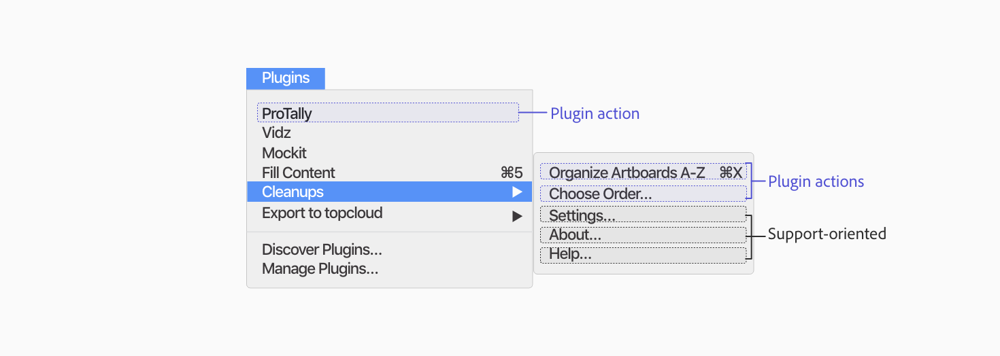
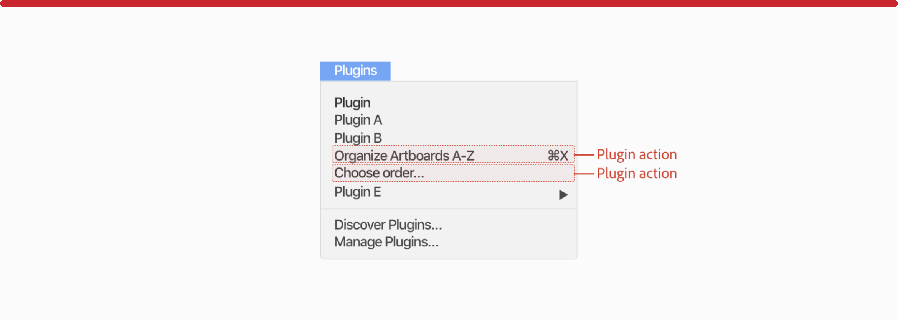
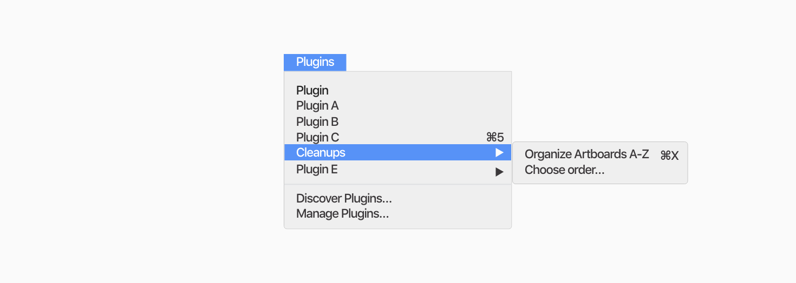

# Navigation

These guidelines provide clarity on the different entry points a plugin can have. An entry point is how users access your plugin, users can access a plugin through the menu bar or a keyboard shortcut.

- Entry points
- Menu architecture - Top menu and Submenu items
- Keyboard shortcuts

----------

  
 
# Entry Points

### Menu bar

### Plugin Launch pad 

  

# Menu architecture - Top menu and Submenu items

### UX Requirements 

**Plugin actions (entry point)**  
Executes a plugin action or open modal.

### Best practices
**Support-oriented items**  
Provide help links, about tutorials or global settings.

**Settings**  
If the plugin handles default preferences then consider having “plugin settings” as part of the submenu. (ex: export options, spacing rules)

**About**  
Users can refer back to onboarding materials such as tutorials and guides on how to use the plugin.

**Help**  
Provide the user with an external link to help documentation or an email through the submenu.

**Don't**  
Don’t add multiple actions for one plugin as top-level items.

### Top Menu

**Use Case**  
If your plugin has one action or workflow shortcut then the action will be the top menu item. 

**Plugin Label**  
A. Long label names will truncate
B. The top menu label is the plugin name
C. Limit the use of emoji’s as part of the label

### Submenu items

**Use Cases**  
if your plugin needs to handle multiple actions or workflow shortcuts then they will render as a submenu.

**Plugin Label**  
A. If the plugin has a single submenu item then it will be shown as a Top Menu item
B. Long label names will truncate
C. Top menu label is the plugin name
D. Submenu labels - action labels should have a descriptive name (i.e: Copy CSS)
E. When a plugin needs further user action in order to continue, then at the end of the submenu label should use “…”
F. Limit the use of emoji’s as part of the label

  

# Keyboard shortcuts

If you are considering having a shortcut for your plugin, make sure to keep these guidelines in mind. 

### Best practices

If the user has another plugin with the same shortcut already installed, the new installed plugins shouldn’t expect to have that same shortcut.

- Can use a combination of “Shift” “Alt/Option” and “Control”

- Keyboard shortcuts are used by power users

- A keyboard shortcut can be used as an entry point but account for possible shortcut collisions
