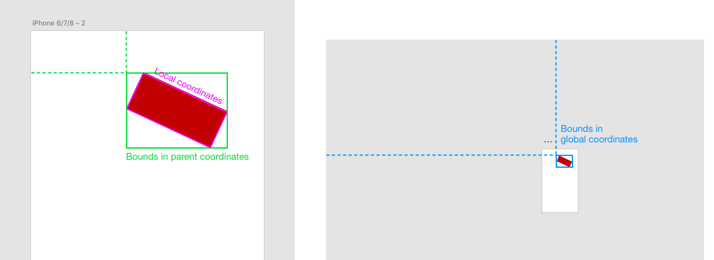

##### Coordinate spaces & units

Sizes and distances in XD are specified in DPI-independent pixels, equivalent to pixels on a 1x display. This is similar to the "CSS
pixels" used in web design.

Each layer of the scenegraph tree can apply a _transform_ (rotation and/or translation), creating a hierarchy of nested _coordinate
spaces_. Due to rotation, the X and Y axes of different coordinate spaces might point in different directions. Take the example of
a rotated rectangle that is inside an artboard:

The top-left corner of a node is not always located at (0,0) in its own local coordinate space. Use [`localBounds`](../scenegraph.md#SceneNode+localBounds)
to get the true top-left of a node. For example, the baseline of a [Point Text node](../scenegraph.md#Text) is at Y=0 in its local coordinates, so its
upper-left corner is at a negative Y value. Similarly, centered or right-aligned text will start at a negative X value in local coordinates.

Here are some examples of nodes where the local origin is not the node's visual top-left corner:

Typically, when discussing the bounds of a node we are referring to the bounds of its _path outline_ &ndash; the hairline "spine" that its fill
fits within and that the thickness of its stroke is anchored to. Nodes may have visible pixels that extend _outside_ the path outline bounds.
For example, a center or outside stroke protrudes beyond the path outline, as does the dropshadow and parts of the "Object Blur" effect:

If you need a bounding box that encompasses _all_ visible pixels of an object, use [`globalDrawBounds`](../scenegraph.md#SceneNode+globalDrawBounds).
The draw bounds are the bounds used when exporting a bitmap image, for example. However, in most other cases (including align/snapping), XD uses the
path outline bounds.