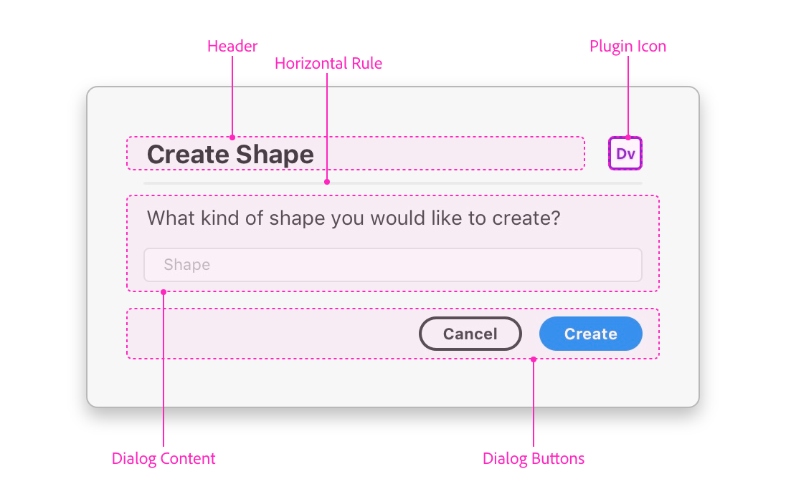

# Dialogs

A modal dialog is used to display important information and ask for user input. XD Plugins can display user interface in the form of **modal dialogs**.


Dialogs appear over the XD document, and prevent further interaction with the underlying document. Dialogs are dismissed in any one of the following manners:

* The user presses the ESC key
* The user presses ENTER (assuming the plugin supplies an `onsubmit` handler)
* The user clicks or touches a button designed to dismiss the dialog.

Dialogs are highly intrusive, and should only be used when absolutely necessary.

## Anatomy















## Usage

When it comes to building the user interface, XD exposes an API surface that looks and feels a lot like what you would get in a web browser, namely:

* HTML5 DOM (Document Object Model) API
* CSS
* JavaScript

These APIs and standards can be used to create compelling user interfaces, even inside modal dialogs.

The above example is a typical modal dialog. Modal dialogs consist of:

* A dialog element (`<dialog>`) that is added to the DOM and contains everything that follows
* A form element (`<form>`) that wraps around the content of the dialog
* A heading (`<h1>`), which may also display the plugin's icon
* A horizontal rule (`<hr />`)
* Some body content
* A footer (`<footer>`) with one or more buttons (`<button>`)

The margins and padding that surround the structure are provided automatically. There is generally _no need_ to specify or override these margins in your own user interface, unless you want to do so.

## Building Modal Dialogs

You can build modal dialogs using any method that creates an HTML5 DOM structure. This means you can use `document.createElement`, `innerHTML`, jQuery, React, and other frameworks.

Let's examine a simple dialog and how we might create it.








```html
<style>
    #dialog form {
        width: 360px;
    }
    .h1 {
        align-items: center;
        justify-content: space-between;
        display: flex;
        flex-direction: row;
    }
    .icon {
        border-radius: 4px;
        width: 24px;
        height: 24px;
        overflow: hidden;
    }
</style>
<dialog id="dialog">
    <form method="dialog">
        <h1 class="h1">
            <span>Create Shape</span>
            
        </h1>
        <hr />
        <p>Please enter the kind of shape you'd like to create. You can also include additional options by separating them with spaces.</p>
        <label>
            <span>Shape</span>
            <input type="text" placeholder="e.g., Rectangle 10 10 20 40" />
        </label>
        <footer>
            <button uxp-variant="primary">Cancel</button>
            <button type="submit" uxp-variant="cta">Create</button>
        </footer>
    </form>
</dialog>
```



```js
let ourDialog;
function showOurDialog() {
    if (!ourDialog) {
        ourDialog = document.createElement("dialog");
        ourDialog.innerHTML = `
<style>
    form {
        width: 360px;
    }
    .h1 {
        align-items: center;
        justify-content: space-between;
        display: flex;
        flex-direction: row;
    }
    .icon {
        border-radius: 4px;
        width: 24px;
        height: 24px;
        overflow: hidden;
    }
</style>
<form method="dialog">
    <h1 class="h1">
        <span>Create Shape</span>
        
    </h1>
    <hr />
    <p>Please enter the kind of shape you'd like to create. You can also include additional options by separating them with spaces.</p>
    <label>
        <span>Shape</span>
        <input type="text" placeholder="e.g., Rectangle 10 10 20 40" />
    </label>
    <footer>
        <button uxp-variant="primary">Cancel</button>
        <button type="submit" uxp-variant="cta">Create</button>
    </footer>
</form>
        `;
    }
    return ourDialog.showModal();
}
```



```js
const React = require("react");
const ReactDOM = require("react-dom");

function Form() {
    const styles = {
        form: {
            width: 360;
        },
        h1: {
            alignItems: "center";
            justifyContent: "space-between";
            display: "flex";
            flexDirection: "row";
        },
        icon: {
            borderRadius: 4;
            width: 24;
            height: 24;
            overflow: "hidden";
        }
    };

    return (
        <form styles={styles.form} method="dialog">
            <h1 styles={styles.h1}>
                <span>Create Shape</span>
                
            </h1>
            <hr />
            <p>Please enter the kind of shape you'd like to create. You can also include additional options by separating them with spaces.</p>
            <label>
                <span>Shape</span>
                <input type="text" placeholder="e.g., Rectangle 10 10 20 40" />
            </label>
            <footer>
                <button uxp-variant="primary">Cancel</button>
                <button type="submit" uxp-variant="cta">Create</button>
            </footer>
        </form>
    );
}

let ourDialog;
function showOurDialog() {
    if (!ourDialog) {
        ourDialog = document.createElement("dialog");
    }
    ReactDOM.render(<Form />, ourDialog);
    return ourDialog.showModal();
}
function render() {
    return (
        <button>Click Me</button>
    );
}
```




* [DOM Structure](./dialogs/dom-structure.md)
* [Building a Dialog with HTML](./dialogs/building-dialog-with-html.md)
* [Building a Dialog with React](./dialogs/building-dialog-with-react.md)
* [Helpers](./dialogs/helpers.md)

Once a dialog is built, you will need to manage its lifecycle:

* [Showing a Modal Dialog](./dialogs/showing.md)
* [Dismissing a Modal Dialog](./dialogs.dismissal.md)
