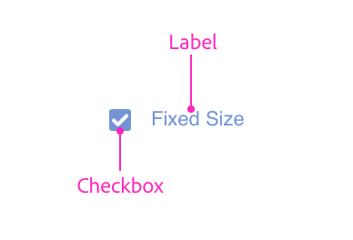

# Checkboxes

Checkboxes allow a user to select one or more items from a group (or toggle an individual item on and off). Unlike some other controls, checkboxes only come in a standard variety.

## Anatomy















## Usage

You can render a checkbox using the following:





```html
<style>
    .row { align-items: center; }
</style>
<label class="row">
    <input type="checkbox" />
    <span>Preserve aspect ratio</span>
</label>
<label class="row">
    <input type="checkbox" checked="true"/>
    <span>Preserve aspect ratio</span>
</label>
```



```js
const labelWrapper = document.createElement("label");
labelWrapper.className = "row";
labelWrapper.style.alignItems = "center";

const checkbox = document.createElement("input");
checkbox.setAttribute("type", "checkbox");
checkbox.checked = true;

const label = document.createElement("span");

labelWrapper.appendChild(checkbox);
labelWrapper.appendChild(label);
```



```js
function render() {
    return (
        <div>
            <label className="row" style={{alignItems: "center"}}>
                <input type="checkbox" />
                <span>Preserve aspect ratio</span>
            </label>
            <label className="row" style={{alignItems: "center"}}>
                <input type="checkbox" checked="true"/>
                <span>Preserve aspect ratio</span>
            </label>
        </div>
    );
}
```



## Indeterminacy

Checkboxes can be in an indeterminate state. This can be set only via the `indeterminate` property (not an attribute). If set to `true`, the checkbox will display with a dash instead of a checkmark (or lack thereof).

> **Tip**
>
> Indeterminacy is orthogonal to the checkbox's checked state. Changing the checkbox's state will not change the controls indeterminate state.

## Keyboard

Key        | Action
-----------|--------------
SPACE      | Toggles the checkbox
ENTER      | Toggles the checkbox
TAB        | Navigates to the next focusable control
SHIFT+TAB  | Navigates to the previous focusable control

## Styling

Checkboxes accept a limited amount of styling. You cannot change the following styles:

* Height
* Color of the checkmark or checkbox

## Attributes

### Supported Attributes

* `disabled`
* `type`: `checkbox`
* `checked`: `true`
* `autofocus`: `autofocus`

### Unsupported Attributes

* `autocomplete`
* `form`
* `formaction`
* `formenctype`
* `formmethod`
* `formnovalidate`
* `formtarget`
* `name`
* `value`

## Supported Events

* `change`
* `click`

## Known Issues

* Checkboxes do not receive keyboard or pointer events.
* Checkboxes may fail to render correctly if in a scrollable container. To work around this issue, make sure the containing element has a background color. (`transparent` does not count; macOS only.)
* It is not currently possible to set a checkbox to `checked` without also passing a value to the attribute. This means `<input type="checkbox" checked/>` will fail to render a checked checkbox. Instead you must use `<input type="checkbox" checked="true" />`
* In React, checkboxes do not trigger `change` events. You can use a `ref` instead to assign an event handler.

    ```js
    return (
        <input type="checkbox" ref={el => el && el.addEventListener("change", e => this.onchecked(e))} />
    );
    ```