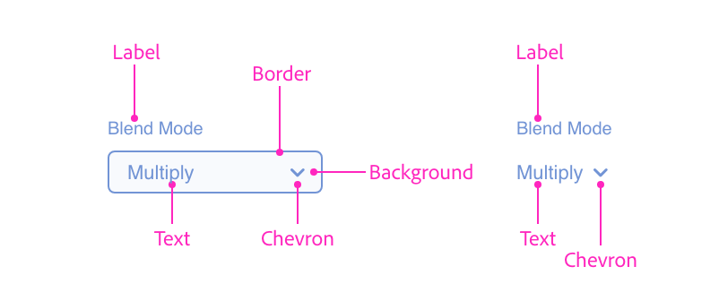
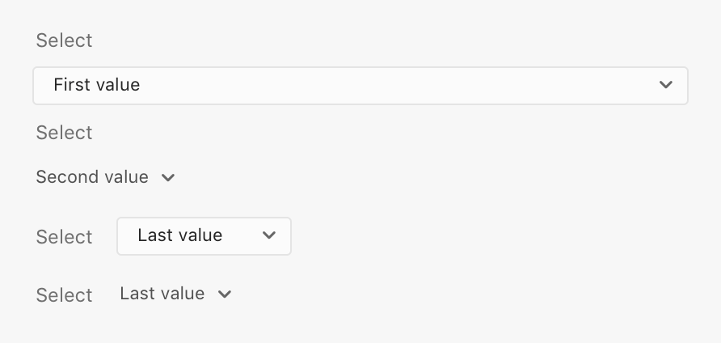
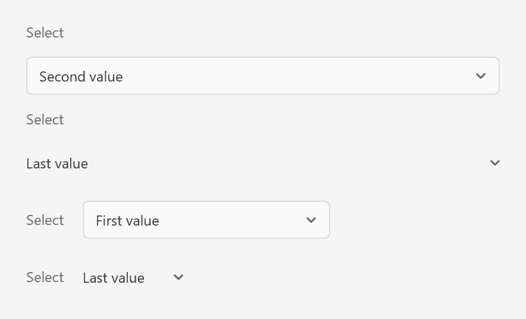

# Dropdowns

Dropdowns (or select lists) allow the user to select an item from a dropdown list. There are various **loudness** options available.

## Anatomy

















```html
<style>
    .row { align-items: center; }
</style>
<label>
    <span>Select</span>
    <select>
         <option value="1">First value</option>
         <option value="2">Second value</option>
         <option value="9">Last value</option>
    </select>
</label>
<label>
    <span>Select</span>
    <select uxp-quiet="true">
         <option value="1">First value</option>
         <option value="2">Second value</option>
         <option value="9">Last value</option>
    </select>
</label>
<label class="row">
    <span>Select</span>
    <select>
         <option value="1">First value</option>
         <option value="2">Second value</option>
         <option value="9">Last value</option>
    </select>
</label>
<label class="row">
    <span>Select</span>
    <select uxp-quiet="true">
         <option value="1">First value</option>
         <option value="2">Second value</option>
         <option value="9">Last value</option>
    </select>
</label>
```



## Usage

You can render a typical dropdown using the following:





```html
<label>
    <span>Target Artboard</span>
    <select>
        <option value="artboard-1">Icon</option>
        <option value="artboard-2">Thumbnail</option>
        <option value="artboard-3">Preview</option>
    </select>
</label>
<label>
    <span>Target Artboard</span>
    <select uxp-quiet="true">
        <option value="artboard-1">Icon</option>
        <option value="artboard-2">Thumbnail</option>
        <option value="artboard-3">Preview</option>
    </select>
</label>
```



```js
const labelWrapper = document.createElement("label");
const label = document.createElement("span");
label.textContent = "Target Artboard";

const select = document.createElement("select");
select.uxpQuiet = true; // if you want a quiet dropdown

const options = [
    ["artboard-1", "Icon"],
    ["artboard-2", "Thumbnail"],
    ["artboard-3", "Preview"]
].map(([val, text]) => {
    const el = document.createElement("option");
    el.setAttribute("value", val);
    el.textContent = text;
    return el;
});

options.forEach(opt => select.appendChild(opt));
labelWrapper.appendChild(label);
labelWrapper.appendChild(select);
```



```js
function render() {
    return (
        <div>
            <label>
                <span>Target Artboard</span>
                <select>
                    <option value="artboard-1">Icon</option>
                    <option value="artboard-2">Thumbnail</option>
                    <option value="artboard-3">Preview</option>
                </select>
            </label>
            <label>
                <span>Target Artboard</span>
                <select uxp-quiet="true">
                    <option value="artboard-1">Icon</option>
                    <option value="artboard-2">Thumbnail</option>
                    <option value="artboard-3">Preview</option>
                </select>
            </label>
        </div>
    );
}
```



## Guidelines

##### Include a Label

Dropdowns should always have a label &mdash; otherwise the dropdown can be ambiguous. There are occasions where context may make what the dropdown does obvious (for example, a sort-by dropdown).

##### Label Position

Ensure that the label is rendered _above_ or _to the left of_ the dropdown. When rendering labels to the left, you can use code like the following:

```html
<style>
    .row { align-items: center; }
</style>
<label class="row">
    <span>Order</span>
    <select>...</select>
</label>
```

##### Truncation

Avoid truncating items by ensuring that the dropdown is wide enough for the longest item.

##### Capitalization

The dropdown's label should use title case, while the items themselves should use sentence case.

## Keyboard

Key        | Action
-----------|--------------
SPACE      | Displays the dropdown (if closed) or selects the highlighted item
UP ARROW   | Displays the dropdown (if closed) or selects the previous item in the select list
DOWN ARROW | Displays the dropdown (if closed) or selects the next item in the select list
ENTER      | Submits the active form (if dropdown is closed) or selects the highlighted item
TAB        | Navigates to the next focusable control
SHIFT+TAB  | Navigates to the previous focusable control

## Styling

Dropdowns accept a limited amount of styling. You cannot change the following styles:

* Minimum width
* Font family, color, or weight
* Height
* Position of the chevron
* Color of the dropdown's border or chevron
* Background color

## Attributes

### Supported Attributes

* `disabled`
* `value`
* `autofocus`: `autofocus`
* `uxp-quiet`: `true`

### Unsupported Attributes

* `autocomplete`
* `form`
* `formaction`
* `formenctype`
* `formmethod`
* `formnovalidate`
* `formtarget`
* `name`

## Supported Events

* `change`

## Known Issues

* Dropdowns do not receive keyboard or pointer events.
* `<select value="…"/>` does not show the value as selected. Instead, get a reference to the element and call `setAttribute("value", …)`.
* `<option>` tags *must* have a `value` attribute, or referencing the `select`'s `value` property will return `undefined`.
* `<option>` tags do not support the `disabled` attribute.